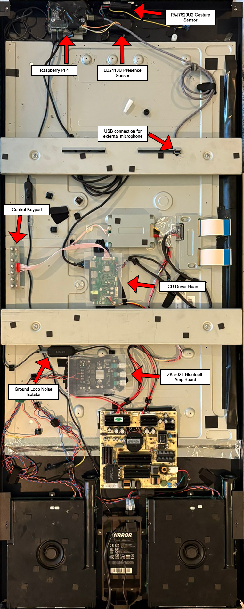
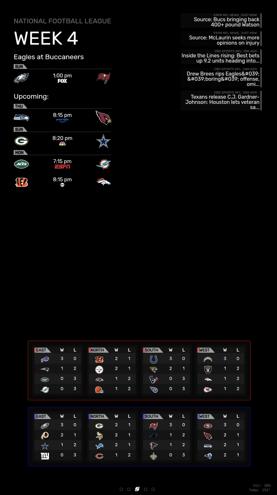
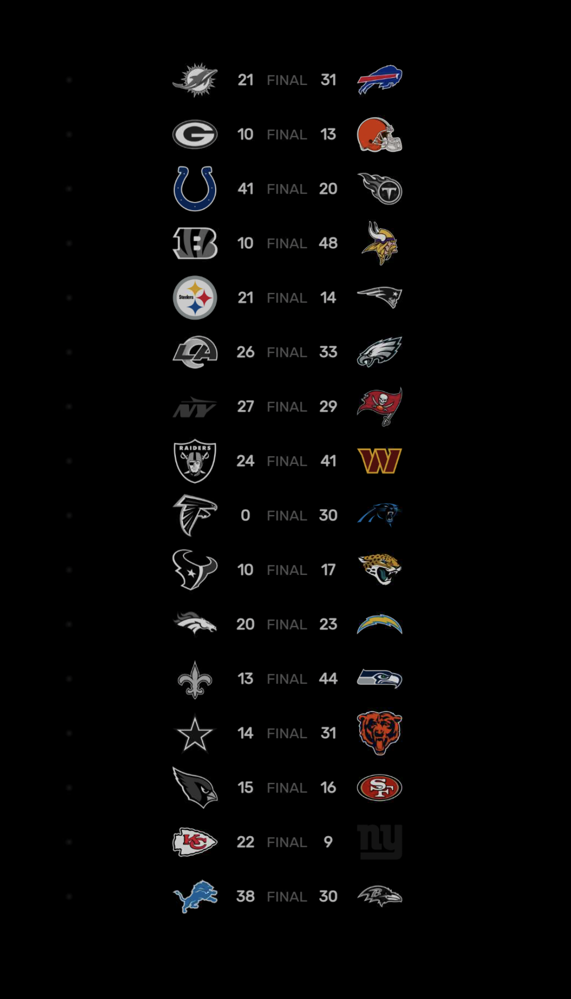
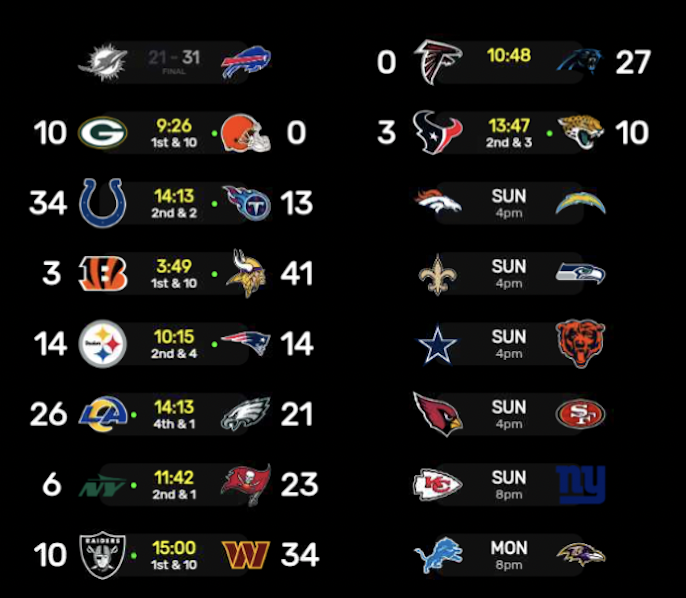
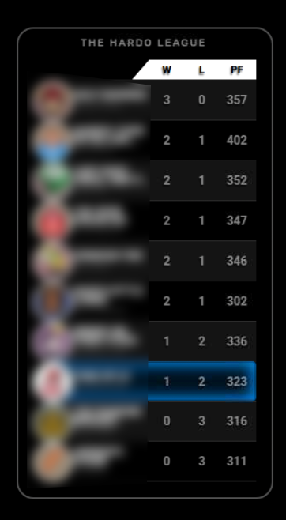

# 🪞 Smart Mirror IoT Dashboard

**Full‑stack, real‑time IoT system** transforming a repurposed Lululemon mirror into a voice‑controlled data display with multi‑sensor input, live APIs, and streaming media.

- **Scale:** 40+ custom MagicMirror modules, 15+ APIs, 4 coordinated services (MagicMirror, Flask, Rhasspy, UxPlay)  
- **Signals:** voice (wake word + live transcript), presence (LD2410C), gesture (PAJ7620U2), AirPlay metadata  
- **Optimized for Pi:** rate‑limiting, staggered polling, memory/CPU tuning

<table>
<tr>
<td width="50%">

<br><em>Internal components</em>
</td>
<td width="50%">

<br><em>Live homepage</em>
</td>
</tr>
</table>

---

## TL;DR — What I Actually Built

**Software**
- Real‑time **voice UI** with custom wake word (“Janice”) and **word‑timed on‑screen transcription**
- **Scene orchestration** engine with context‑aware pages (music, sports, fantasy, news, weather)
- **Data pipeline** integrating 15+ APIs with **staggered requests**, **backoff**, and **graceful UI fallbacks**
- **AirPlay bridge** (UxPlay) → **screen mirroring** + **auto scene switching** + album art/metadata ingestion
- **Sensor fusion:** presence → power/scene behavior; gestures → navigation/intents

**Hardware**
- Repurposed **Lululemon mirror** (frame/monitor/speakers/PSU retained)
- **Raspberry Pi 4**, LD2410C presence sensor, PAJ7620U2 gestures, USB mic, ZK‑502T amp, ground‑loop isolator, LCD driver board

---

## Why It Matters (Data + Platform)

- **Streaming thinking:** word‑level timings, MQTT events, and UI updates land within target latencies on constrained hardware.
- **API hygiene at scale:** 15+ sources with unequal SLAs → **global scheduler** (offsets: fantasy +2s, NFL +4s; live‑state cadences).
- **Robust UX:** visible fallbacks (cached data, skeleton states) keep the mirror informative even during upstream glitches.
- **Edge constraints:** Pi‑friendly memory and CPU budgets with measurable wins (RAM down to ~2.8 GB from 4 GB+).

---

## System Overview

**Core capabilities**
- 🎤 **Speech/NLP:** custom wake word; real‑time transcript with pacing (ellipsis handling, WPM control)
- 🪞 **Dynamic content:** icon‑based scene router; stateful “music page” on AirPlay; sports/fantasy pages during games
- 🔗 **Microservices:** Flask gateway + MQTT events; Rhasspy in Docker; UxPlay for media metadata
- 📊 **Real‑time data:** ESPN, OpenWeather, Reddit/RSS, quotes/facts/jokes, Google/ICS calendars

**Service map (simplified)**

```
[Mic] → Rhasspy (Docker) → MQTT ┐
                                ├→ MMM‑WakeWordIndicator → Live transcript UI
[LD2410C] → GPIO → MM Modules ┘
[PAJ7620U2] → Gestures → Scene/Intent modules
[UxPlay] → metadata.txt + coverart.jpg → NowPlaying + Music Scene
[APIs: ESPN/OWM/RSS/etc] → Fetch scheduler (offsets/backoff) → UI modules
```

---

## Selected Results & Demos

- **Real‑time voice UI:** word‑by‑word transcript synced to speech; clean session close via `hermes/tts/sayFinished`  
  

- **Sports telemetry:** live possession, down/distance, red‑zone indicators, standings, fantasy matchups  
  <table>
  <tr>
  <td width="33%"><br><em>Scores & standings - A comprehensive weekly view of the most important NFL information, including upcoming matchups for your favorite team and all primetime game times (top left), auto-updating news stories via RSS feeds (top right), and standings for all NFL divisions (bottom).</em></td>
  <td width="33%"><br><em>All games live - A fullscreen portrait view of all NFL matchups for a given week. This screenshot shows the page on a Sunday after all games had finished.</em></td>
  <td width="33%"><br><em>Drive detail - Shows what these matchups look like with live data (although the data was fabricated for this demo due to timing of capture when no games were being played).</em></td>
  </tr>
  </table>

- **Entertainment & music:** AirPlay triggers scene swap and displays album art  
  <table>
  <tr>
  <td width="50%"><br><em>Jokes & facts rotation</em></td>
  <td width="50%"><br><em>Music scene with automatic AirPlay detection, live album art extraction from WiFi-streamed music, and audio output through powerful mirror speakers. Features rotating background imagery from a curated collection and a pulsing album cover that syncs with playback. This scene automatically activates whenever music is streamed to the mirror.</em></td>
  </tr>
  </table>

---

## Gallery (More Screenshots)

> A visual tour of core pages and states. (All images are in `examples/`.)

| View | Image |
|---|---|
| **Mirror on Fantasy Page (photo)** | <br><em>Features a custom live head-to-head matchup feed with real-time in-game player scoring updates (top), standings for your fantasy football league (bottom left), and results, future matchups, and live scores of all NFL games for the current week (bottom right).</em> |

<table>
<tr>
<td width="50%"><br><em>Live Scores (compact)</em></td>
<td width="50%"><br><em>ESPN Fantasy Football League Standings</em></td>
</tr>
</table>

---

## Data & Platform Highlights

### Real‑Time Voice & UI
- **Wake word:** “Janice” (custom via Pico trainer / Rhasspy)
- **Transcript pacing:** words‑per‑minute control + ellipsis pause to mimic natural cadence
- **Event lifecycle:** MQTT `sayFinished` guarantees UI teardown → no “ghost overlays”

### API Scheduling & Resilience
- **Staggered calls:** Fantasy (+2s), NFL (+4s) to avoid thundering herds  
- **Cadence by context:** Sports 30 min normally → 1 min during live games; Weather 5 min; News rotate 1–5 min  
- **Fallbacks:** cached last‑good + skeleton loaders maintain perceived responsiveness

### Edge Performance Engineering
- **Memory**: ~2.8 GB typical (down from 4 GB+)  
- **Process isolation**: Rhasspy in Docker; Flask isolates long I/O from UI thread  
- **Systemd**: restart policies, health hints, and clean shutdown hooks

---

## Hardware Build (concise)

**Retained (Lululemon):** frame, 27" LCD, speakers, PSU  
**Added:** Raspberry Pi 4, LD2410C presence, PAJ7620U2 gestures, ZK‑502T amp, ground‑loop isolator, LCD driver, USB mic

<table>
<tr>
<td width="50%">

</td>
<td width="50%">

</td>
</tr>
</table>

---

## Representative Modules (curated)

| Area | Modules (examples) | What they show |
|---|---|---|
| Voice & Scenes | `MMM-WakeWordIndicator`, `MMM-Scenes2`, `MMM-SmartScenes`, `MMM-ScenesLinearBridge`, `MMM-IntentHelper` | live transcript, icon router, timed scenes, intent feedback |
| Sports & Fantasy | `MMM-AllGamesLive`, `MMM-NFLMinimal`, `MMM-FantasyTracker`, `MMM-FantasyStandings`, `MMM-MyScoreboard`, `MMM-StandingsNew` | live drives, scores, matchups, standings |
| Media | `MMM-UxPlayNowPlaying`, `MMM-UxPlayScenes`, `MMM-BackgroundSlideshow` | album art, music scene, backgrounds |
| Info | `MMM-OpenWeatherMapForecast`, `MMM-CalendarExt2`, `MMM-CalendarExtMinimonth`, `MMM-CompactNews`, `MMM-Reddit` | weather, calendars, headlines |
| System & Sensors | `MMM-SimpleStats`, `MMM-SystemStats`, `MMM-Universal-Pir`, `MMM-GroveGestures` | CPU/RAM/temp, presence, gestures |

> Dozens more exist in the repo; the above best showcase the data/real‑time aspects.

---

## Architecture & Project Layout

```
├─ MagicMirror/                    # App runtime
│  ├─ config/                      # config.js.template (env-driven)
│  ├─ modules/                     # 40+ custom/extended modules
│  ├─ css/                         # custom styling
│  └─ examples/                    # screenshots/photos (used in README)
├─ rhasspy-mm-handler/             # Flask gateway (API orchestration)
│  ├─ app.py
│  └─ requirements.txt
├─ rhasspy/                        # Voice assistant config (Docker)
├─ UxPlay/                         # AirPlay server + autostart
└─ PI_SYSTEM_DOCUMENTATION.md      # Extended system notes
```

---

## Data Sources (selected)

- **Weather:** OpenWeatherMap (current/hourly/daily; drives animated overlays)  
- **Sports:** ESPN (NFL live states: possession, D&D, red zone; standings/scoreboards)  
- **Fantasy:** ESPN Fantasy (matchups, live player scoring, standings)  
- **News/Content:** RSS/Reddit/Quotable/Inspirobot/Jokes & Facts  
- **Calendars:** Google Holidays + local ICS  
- **Media:** UxPlay (`metadata.txt`, `coverart.jpg`) for track/artist/album art + **full screen mirroring**

**Scheduler Policy (examples)**
- Weather: **5 min**  
- Sports: **30 min** (→ **2 min** during live games)  
- Fantasy: **30 min** in‑season  
- News: **rotate 1–5 min**, refresh **5–60 min**  
- Staggering: **+2 s** (fantasy), **+4 s** (NFL)

---

## License & Reuse

Personal project; individual modules may carry their own licenses. Use ideas/components as you like for your setup.

---

**One‑liner:**  
*A Pi‑powered, voice‑first, sensor‑aware dashboard that fuses streaming speech, structured sports/fantasy telemetry, and live content into a resilient, real‑time display—built end‑to‑end with careful attention to data pipelines and edge performance.*

